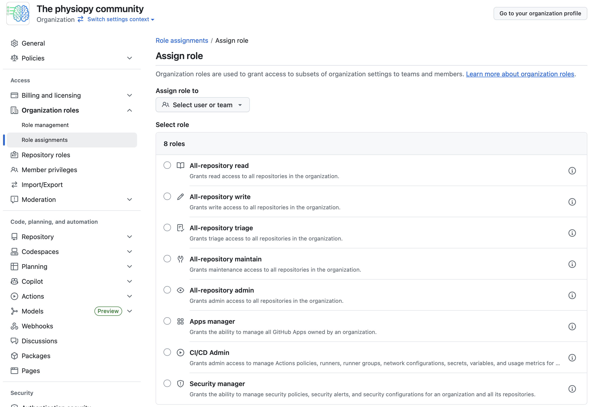
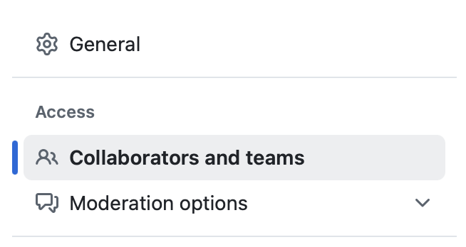

# GitHub Roles and Permissions for Physiopy

This document describes Physiopy's use of different role assignments which define what permissions users have within the organization. It is the responsibility of the Steering Committee (particularly the Community Manager(s)) to implement these rules, and periodically check if they are up to date. 

We are aiming for a simple approach to begin with. Please reflect before adding further complexity to role assignments. 

## Organization permissions

The below rules should be implemented via the 'Role assignment' option on the organization settings page. Add a [team of users](https://github.com/orgs/physiopy/teams), or an individual user, to a specific role. 

### Organization Owners or Maintainers 

**Must** 
- There should be two or more organization owners.

**Advised** 
- Owners should be Steering Committee (SC) members. A non SC members should typically not be an owner, unless the SC unanimously agrees. 
- Not all SC members have to be owners. In this case, consider giving them the 'All-repository maintain' role, which applies to repositories across the whole organization. This depends on the scope of the SC role, and this can be decided within the SC members. 

### 'All-repository-triage'

**Advised** 
- For all other community members, generally we give them permissions at the level of the repository (see below), not at the level of the organization. However, for active community members that help maintain the organization as a whole, it is recommended to give them triage access to all repositories. This allows them to manage issues and pull requests (e.g. assigning users to issues and pull requests, adding labels, closing issues and pull requests) without the ability to push code. 

## Repository permissions

The below rules should be implemented via the 'Collaborators and teams' option on the repository settings page. Add a [team of users](https://github.com/orgs/physiopy/teams), or an individual user, to a specific role. 

**Must**
- Each Physiopy repository should have a user assigned to Maintain it (this user should have **Maintainer** privileges, or above, on this repository)
- All Physiopy repositories should be public by default, unless the SC unanimously agrees there is a need for a private repository. A public repository means that anyone on the internet has read access by default. 

**Advised**

- Each Physiopy repository should be associated with a [Team](https://github.com/orgs/physiopy/teams) or Child Team.
   - This Team/Child Team assigns the base role for a user contributing to this repository.
   - There should be a maintainer of this Team/Child Team.
- *Team doesn't give a specific user enough privileges?* Elevated roles, for this repository only, can be given to specific users. If this case happens regularly, consider increasing the Team access privileges instead. 
- *Team gives a specific user too many privileges?* Do not add them to the team, but add them separately to the repository with the desired access role. This may be suitable for an outside collaborator that is working on this project for a specific window of time or a narrowly defined task. If this case happens regularly, consider decreasing the Team access privileges instead.    
